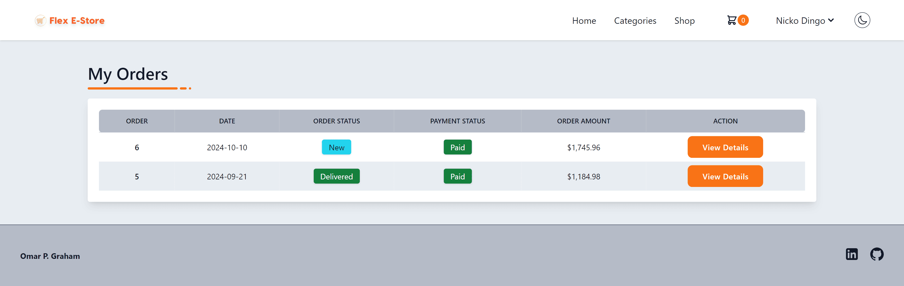

# Flex E-Store

## Table of contents

- [Overview](#overview)
- [My process](#my-process)
  - [Built with](#built-with)
  - [Screenshot](#screenshot)
- [Author](#author)

## Overview

This e-commerce application leverages the TALL stack (Tailwind CSS, Alpine.js, Laravel, and Livewire) to create a modern, responsive, and dynamic shopping experience.

- Tailwind CSS provides a utility-first approach to styling, allowing for rapid and customizable UI development.
- Alpine.js adds interactivity with minimal JavaScript, making the app reactive and user-friendly.
- Laravel serves as the robust backend framework, handling everything from routing to database management with ease.
- Livewire integrates seamlessly with Laravel to enable dynamic, real-time updates without the need for complex JavaScript.

## My Process

### Built with

- Laravel [https://laravel.com](https://laravel.com)
- Livewire [https://livewire.laravel.com/](https://livewire.laravel.com/)
- Alpine JS [https://alpinejs.dev/](https://alpinejs.dev/)
- Tailwind CSS [https://tailwindcss.com/](https://tailwindcss.com/)
- FilamentPHP [https://filamentphp.com/](https://filamentphp.com/)
- Stripe [https://stripe.com/](https://stripe.com/)
- HeroIcons [https://heroicons.com/](https://heroicons.com/)
- Meraki UI [https://merakiui.com/](https://merakiui.com/)

### Screenshot

## Author

- Frontend Mentor - https://www.frontendmentor.io/profile/omar-p-graham
- LinkedIn - https://www.linkedin.com/in/omar-p-graham/